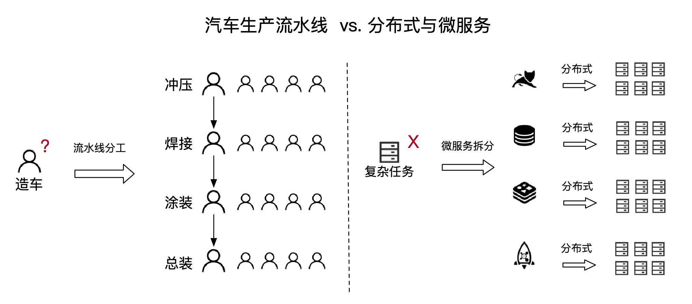

# 链路追踪（Tracing）其实很简单——分布式链路追踪的起源

> 作者：夏明（涯海）    
> 创作日期：2022-07-14  
> 专栏地址：[【稳定大于一切】](https://github.com/StabilityMan/StabilityGuide)    

冬日的周末，你躺在温暖的被窝里，点了一份可口的外卖；双11的零点，看着满满的购物车，你在疯狂提交订单；假期约上小伙伴，一起激情开黑，五杀超神……在这个精彩纷呈的互联网世界里，你的屏幕背后又隐藏着什么？你的每一次点击行为，在 IT 的世界里会流经哪些节点，调用哪些服务，带来哪些变化？这一切仿佛自然天成，细细思索却又庞杂精密，超出了人力探索的边界。而分布式链路追踪就是追溯请求在 IT 系统间流转路径与状态的一门技术，接下来，让我们通过对分布式链路追踪的学习，一起来揭秘这个神奇的 IT 世界吧！

说到分布式链路追踪，就绕不开分布式系统与微服务的兴起。早期的 IT 系统非常的简单，几乎所有程序都运行在同一个节点，互相之间也没有什么依赖。但是随着硬件技术突飞猛进，硬件成本大幅下降，软件的复杂度却越来越高。单一系统的性能已经无法满足复杂的数据计算任务，而软件逻辑的复杂性也导致维护成本大幅上升。另外，单节点的可靠性也难以保障，不可避免的会偶尔出现宕机等行为，影响软件的可用性。**“性能、可维护性和可用性”这三大因素促使了分布式系统与微服务的诞生。**

为了解决上述问题，人们很自然的想到，既然一个硬件节点无法很好的运行软件，那么，能不能够通过多个节点来共同完成？并且为不同的节点分派不同的任务，提高效率。这就好比一个人很难造出一辆汽车，但是通过不同角色的分工协同就可以流水线的量产汽车，分布式系统与微服务的理念亦是如此，如下图所示。

分布式系统与微服务自诞生之日起，就被予以广泛的应用，主要得益于以下几点优势：

* **扩展性：** 分布式系统天然具备“按需扩展”的能力，比如双11大促前通过添加机器实现快速水平扩容，大促结束后释放机器，充分利用云计算的分时复用能力，节约成本。利用微服务，还可以实现按需精准扩容，比如登录服务扩容10倍，下单服务扩容3倍，最大化的节省资源。

* **可靠性：** 分布式系统可以有效抵抗“单点风险”，不会因为某一个节点的故障，影响整体的服务可用性。结合流量调度、离群实例摘除和弹性扩容等技术，甚至可以实现故障自愈。

* **可维护性：** 分布式系统的可维护性更强，一方面我们将一个复杂服务拆分成多个简单的微服务，每一个微服务的逻辑都更加清晰、更易理解。就好比我们写代码，将一个几百行的复杂函数重构成若干个简单函数，代码可读性就会直线上升。另一方面，一些通用的微服务可以被高度复用，无需重复开发和维护，比如你在开发一个电商 APP，可以直接调用第三方提供的支付、物流等服务接口，整体开发和维护效率将大幅提升。

虽然分布式系统与微服务具有非常显著的优势，但凡事有利必有弊，它们在有效解决原有问题的基础上，也为系统开发和运维带来了新的挑战，主要包括以下几点：

* **模糊性：** 随着系统的分布式程度越来越高，异常表象与根因之间的逻辑联系变得愈加模糊，问题诊断的难度急剧上升。比如 A、B 两个服务共享同一个数据库实例，当 A 服务在压测期间，大量占用数据库的服务端连接和计算资源，会导致 B 服务出现连接超时或响应变慢等问题。如果 B 服务是通过 C 服务间接依赖该数据库实例，问题的定位就会变得更加困难。

* **不一致：** 虽然分布式应用从总体上变的更加可靠，但是每一个独立节点的状态却难以保证。导致这种不一致的原因有很多，比如前文提到的单机故障这种预期外的不一致，或者应用 Owner 执行分批发布或流量灰度时导致的预期内行为不一致。这种不一致性导致我们难以确定一个用户请求在系统内的准确执行路径与行为逻辑，可能引发不可预知的逻辑灾难。

* **去中心化：** 当你的系统拥有上千个微服务镜像运行在数百台机器实例上，你该如何梳理它们之间的依赖关系，又该如何找到核心业务的关键执行路径？特别是在分布式的场景下，你没有一个中心化的节点（Master）来保存每个服务之间的依赖与调度状态，每个独立节点都在自行其是，无法分辨自己在整个系统中的位置，只能“盲人摸象、管中窥豹”，缺乏全局视图。

分布式系统与微服务带来的新挑战无疑让人头痛，但也带来了新技术的发展契机，科技的发展总是这样循环往复，螺旋式上升。它们带来的新问题，促使了分布式链路追踪的诞生，使你能够有效的观察全局，追踪流量。我们将在下个章节了解分布式链路追踪的诞生历程与核心理念。

## 推荐阅读
《链路追踪（Tracing）其实很简单》系列文章

- 1 什么是分布式链路追踪
	- [1.1 分布式链路追踪的起源](./链路追踪其实很简单——分布式链路追踪的起源.md)
	- [1.2 分布式链路追踪的诞生](./链路追踪其实很简单——分布式链路追踪的诞生.md)
	- [1.3 分布式链路追踪的应用与兴起](./链路追踪其实很简单——分布式链路追踪的应用与兴起.md)
	- [1.4 分布式链路追踪的挑战与限制](./链路追踪其实很简单——分布式链路追踪的挑战与限制.md)
- 2 分布式链路追踪的基础用法
	- [2.1 请求轨迹回溯](./链路追踪其实很简单——请求轨迹回溯.md)
	- [2.2 多维链路筛选](./链路追踪其实很简单——多维链路筛选.md)
	- 2.3 链路实时分析、监控与告警
	- 2.4 链路拓扑

## 推荐产品
- [阿里云 ARMS 可观测](https://help.aliyun.com/product/34364.html)
- [阿里云链路追踪](https://help.aliyun.com/document_detail/196681.html)

## 推荐社区
【稳定大于一切】打造国内稳定性领域知识库，**让无法解决的问题少一点点，让世界的确定性多一点点。**

- GitHub 专栏地址：[https://github.com/StabilityMan/StabilityGuide](https://github.com/StabilityMan/StabilityGuide)
- 微信公众号：万物可观测
- 钉钉交流群号：30000312
- 如果阅读本文有所收获，欢迎分享给身边的朋友，期待更多同学的加入！
