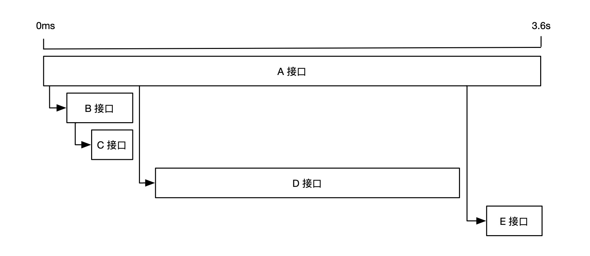
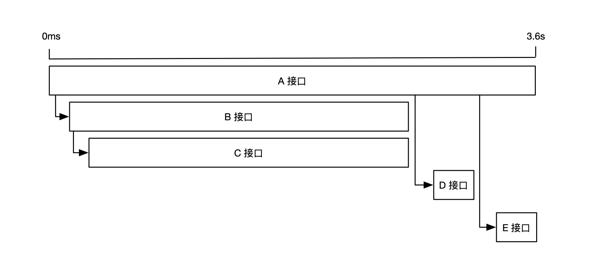
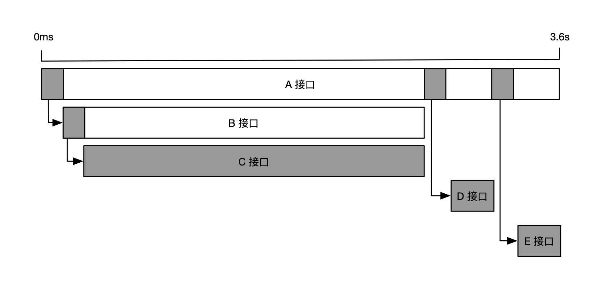
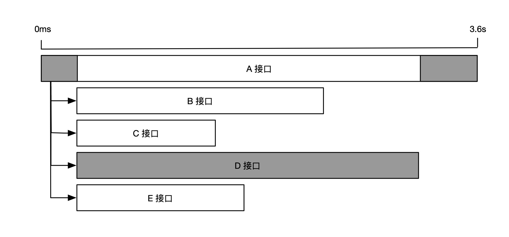
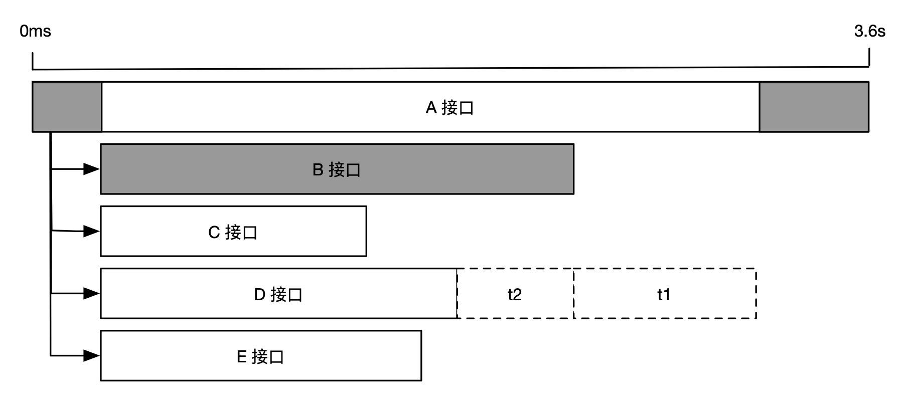
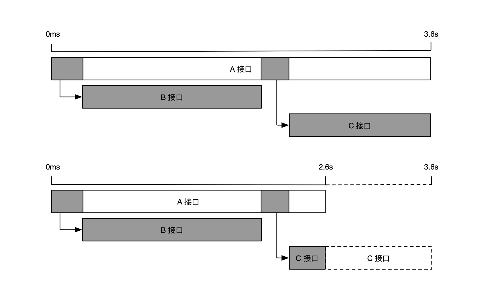
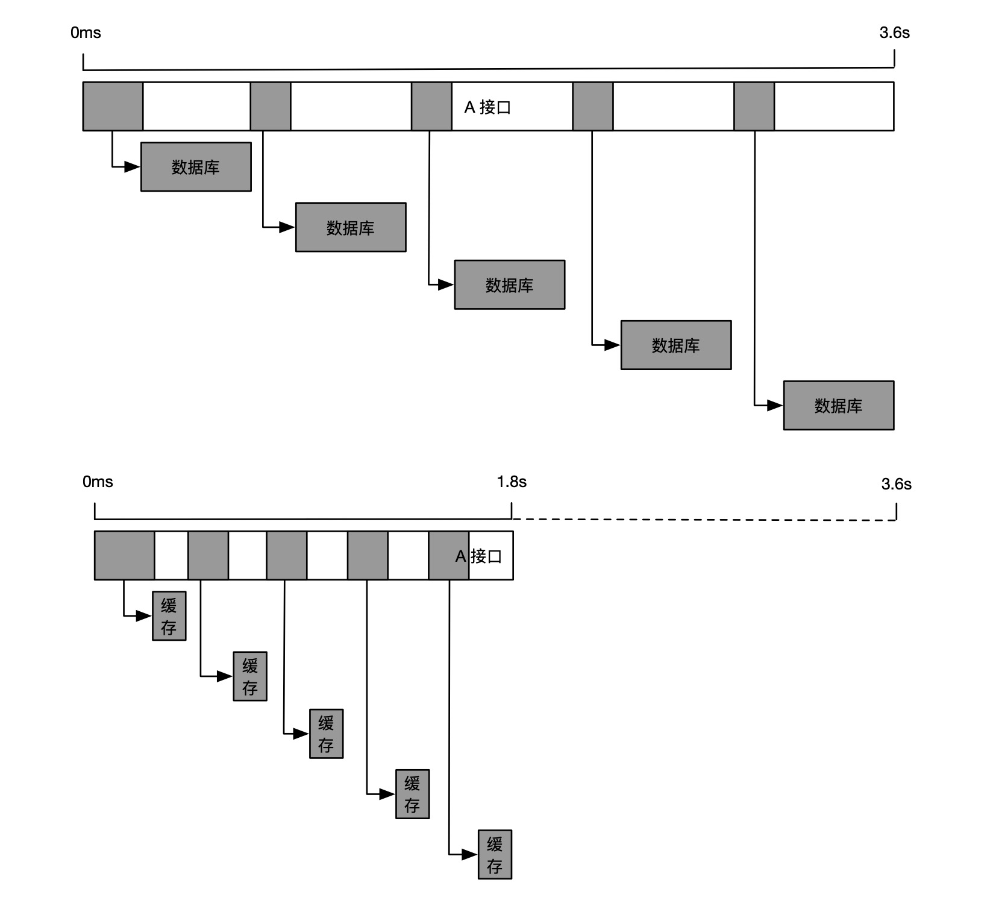
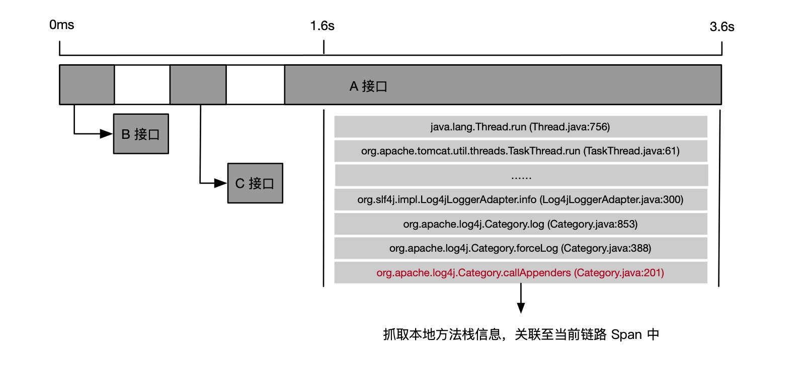
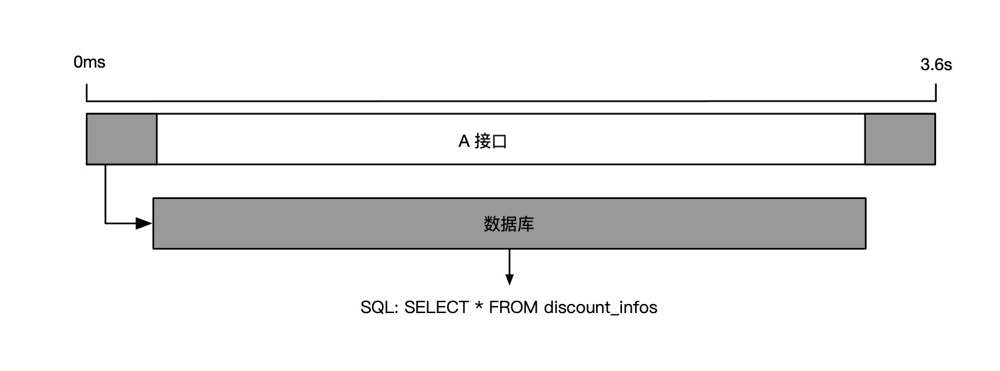
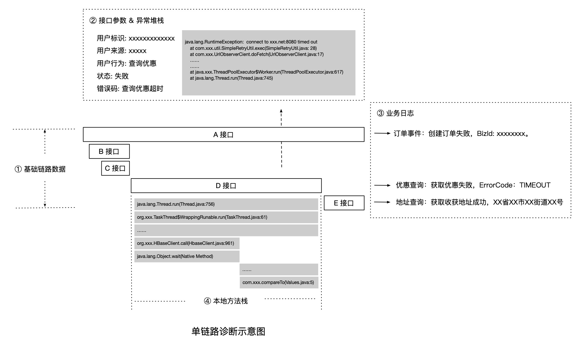

# 链路追踪（Tracing）其实很简单——请求轨迹回溯

> 作者：夏明（涯海）    
> 创作日期：2022-07-14  
> 专栏地址：[【稳定大于一切】](https://github.com/StabilityMan/StabilityGuide)  

在日常生活中，我们可能都经历过以下场景：疫情突然爆发，去医院排队做核酸检测，但是预约检测页面迟迟无法打开；iphone 新款发布日促销秒杀，下单页面一直卡住转菊花；超市店庆打折，队伍排成长龙，前面的人付款却一直失败；游戏更新大版本，在线人数过多，导致服务器卡的人物一直在“漂移”。作为用户，这些问题令我们的产品体验变得非常差，有耐心的同学还会吐槽几句，没耐心的同学早已转身离开。试想一下，如果你是该系统的开发/运维人员，又该如何避免此类问题的发生，或者快速定位止损呢？

本章我们将以业务 Owner（小玉）的视角，逐步了解分布式链路追踪的各种基础用法：小到单次用户请求的异常根因诊断，大到全局系统的强弱依赖梳理，分布式链路追踪都能给予你确定性的答案。

小玉是一家电商公司订单中心的业务 Owner，她的核心 KPI 就是保障创建订单 createOrder 接口的可用性，比如响应时延低于 3s，成功率大于 99.9%。一旦该接口的可用性出现问题，会直接影响用户下单行为，造成业务资损，进而影响小玉的绩效和年终奖。

但是创建订单接口直接或间接依赖了多个其他系统的服务，例如资金、地址、优惠、安全等。一旦某个下游系统服务的可用性出现问题，也会造成创建订单失败或超时。为此，小玉特别头痛，每当创建订单接口不可用时，她都非常心急，却不知该如何定位根因，只能拉上所有的下游接口负责人一起评估，不仅费时费力，低效的排查也造成了业务损失的进一步扩大，经常被老板痛骂。

当小明了解这个情况后，向她推荐接入了分布式链路追踪系统，并通过一系列故障应急案例，指导她如何利用 Tracing 定位问题，梳理风险，提前预警，切实提高了订单中心的可用性。

小玉经常会遇到各种用户反馈的创建订单超时问题，以往她对此类问题颇有些束手无策。不过，接入分布式链路追踪系统后，通过调用链准确回溯超时请求的调用轨迹，小玉就可以轻松定位耗时最长的接口信息，如下图所示，A 接口超时的主要原因是调用 D 接口导致的。

但是，如果是下面这种情况，A 调用了 B，B 又调用了 C。 那么导致 A 接口超时的根因到底是 B 接口，还是 C 接口呢？

为了区分真正影响用户体验的 Span 耗时，我们先来了解一下关键路径的概念。

## 关键路径
**如果一次 Span 调用有 t 段耗时在关键路径上，那么去掉这 t 段耗时，整条链路的总体耗时也会相应的缩短 t 段时间。**仍以上面那条链路为例，灰色部分表示关键路径，缩短任意关键路径上的耗时都可以减少整体耗时。此时，我们可以判断 A 接口超时的主要原因是 C 接口导致的。

再来看另一种情况，如果 A 接口同一时间并行调用 B、C、D、E 接口，那么耗时最长的 D 接口就成为关键路径，如下图所示。

但是，如果我们将 D 接口耗时减少 t1+t2 两段时间，整体耗时却只减少了 t1 段时间，因为，当 D 接口耗时小于 B 接口时，D 接口就不再是关键路径，而是由 B 接口取代。这就好像主要矛盾被大幅缓解后，次要矛盾就变成了主要矛盾。

综上所述，我们在做耗时性能分析时，应该首先识别出关键路径，然后再做针对性的优化。对于非关键路径上的耗时优化不会对最终的用户体验产生价值。

## 多条链路比对
单条调用链路只能用来分析各个接口的绝对耗时，而无法得知每个接口的耗时变化情况。但是，绝对耗时长不代表这个接口就一定有问题，比如数据存储接口耗时通常要比单纯的计算接口耗时要长，这种长耗时是合理的，无需特别关注。

因此，在诊断性能退化问题时，我们更应该关注相对耗时的变化。比如获取同一个接口在耗时异常时段与正常时段的多条链路进行比对，从而发现导致性能退化的原因。下图展示了 A 接口的两条不同链路，我们可以清楚的看到，虽然第一条链路的 B 接口耗时要比 C 接口耗时长，但是导致 A 接口整体耗时从 2.6s 涨到 3.6s 的原因，其实是 C 接口的相对耗时变长了 1s，而 B 接口的相对耗时几乎不变。因此，当 A 接口的响应时延超过 3s，不满足可用性要求时，我们应该优先分析 C 接口相对耗时增长的原因，而不是 B 接口。

我们再来看一个缓存未命中的例子，如下图所示。第一条链路调用了5次数据库，每一次调用的耗时都不算很长，但是 A 接口整体耗时却达到了 3.6s。当我们比对之前未超时的链路时，发现 A 接口并没有调用数据库，而是请求了5次缓存，整体耗时只有 1.8s。此时，我们可以判断 A 接口超时的原因是调用依赖行为发生了变化，原本应该请求缓存的调用变成了请求数据库，很可能是缓存被打满，或者是该次请求的参数命中了冷数据，最终导致了接口超时。

通过上面两个案例，我们认识到分析性能问题时，不仅需要知道绝对耗时的多少，更要关注相对耗时的变化。当然，有经验的同学如果对自身业务的正常链路形态了若指掌，就可以直接观察异常链路得出结论。

## 关联信息回溯
通过前面的学习，小玉已经成功掌握了调用链的轨迹回溯能力，可以熟练运用调用链分析性能瓶颈点，快速定位异常的接口。
但是，她又遇到了新的困惑，就是找到了异常接口之后，下一步该怎么办？

比如 C 接口的耗时从 0.1s 增长到了 2.1s，导致了上游的 A 接口超时。但是仅仅知道这个信息还不够，C 接口耗时增长背后的原因是什么？如何解决这个问题，让它恢复到原来的性能基线？

很多线上问题，很难只通过接口粒度的链路信息定位根因，需要结合更加丰富的关联数据，指导下一步的行动。

接下来，我们通过几个案例，介绍几类最典型的链路关联数据，以及相应的用法。

### 本地方法栈
小玉负责的订单系统，每天上午十点都会有一波周期性的业务峰值流量，偶尔会出现一些超时请求，但是下游调用耗时都很短，无法判断超时的具体原因，导致这个问题一直悬而未决，为此小玉十分头痛，只好求助小明。正常请求与超时请求的调用链路对比如下图所示。

由于超时请求链路的相对耗时增长主要是 A 接口本身，因此，小明建议小玉启用慢调用方法栈自动剖析功能，自动抓取超时请求的完整本地方法栈，如下图所示。

通过本地方法栈，小玉得知超时请求是卡在 log4j 日志框架 callAppenders 方法上，原来 log4j 在高并发场景的同步输出会触发 “热锁”现象，小玉将 log4j 的日志输出由同步模式改为异步模式后，就解决了业务峰值超时的问题。

如果小玉使用的分布式链路追踪系统，并没有提供慢调用方法栈自动剖析功能，也可以通过 Arthas 等在线诊断工具手动抓取方法栈，定位到异常方法后，再考虑将其添加至本地方法插桩埋点中，进行常态化追踪。

### 自动关联数据
基于分布式链路追踪的框架拦截点，我们可以自动关联多种类型的数据，比如接口请求的出/入参数，调用过程中抛出的异常堆栈，数据库请求的执行 SQL 等等。此类信息不影响调用链的形态，却会极大的丰富链路的信息，更明确的告诉我们为什么会出现这样或那样状况的原因。

比如，有一次小玉接到上游业务方反馈，某个新渠道的商品下单总是超时，经过排查后发现该渠道订单依赖的数据库调用非常的慢，通过分析 SQL 明细才知道这个数据库调用是获取渠道优惠信息，但是没有做渠道过滤，而是全量查询了所有优惠规则，优化 SQL 查询语句后超时问题就解决了。

自动关联数据通常由分布式链路追踪产品默认提供，用户根据自身的需要选择是否开启即可，无需额外的操作成本。一般情况下，SQL明细和异常堆栈关联建议常态化开启，而记录请求出/入参数需要消耗较大的系统开销，建议默认关闭，仅在需要的时候临时开启。

### 主动关联数据
小玉的老板希望能够定期分析来自不同渠道、不同品类、不同用户类型的订单情况，并且将订单接口异常排查的能力向一线运营小二开放赋能，提高用户支持效率。正在小玉一筹莫展之际，小明建议小玉将业务信息关联至调用链上，提供业务标签统计、业务日志轨迹排查等能力。

小玉听取了小明的建议后，首先将渠道、品类、用户类型等业务标签添加到分布式链路追踪的 Attributes 对象中，这样就可以分别统计不同标签的流量趋势，时延分布和错误率变化；其次，小玉将业务日志也关联到分布式链路追踪的 Event 对象中，这样就可以查看一次订单请求在不同系统中的业务轨迹与信息，即使是不懂技术的运营同学也能够清晰的判断问题原因，更有效的支持客户，如下图所示。

由于业务逻辑千变万化，无法穷举，所以业务数据需要用户主动进行关联，分布式链路追踪系统仅能简化关联过程，无法实现完全自动化。此外，自定义标签和业务日志是最常用的两种主动关联数据类型，可以有效地将调用链的确定性关联能力扩展至业务领域，解决业务问题。

## 综合分析
通过本小节的学习，相信大家已经非常熟悉分布式链路追踪的请求轨迹回溯能力，我们再来整体回顾一下：首先调用链提供了接口维度的轨迹追踪，而本地方法栈可以详细描述某个接口内部的代码执行情况，自动关联数据和主动关联数据在不改变链路形态的前提下，极大的丰富了链路信息，有效指导我们下一步的行动。在一些比较复杂的问题场景，需要结合以上信息进行多角度的综合判断，如下图所示。

## 推荐阅读
《链路追踪（Tracing）其实很简单》系列文章

- 1 什么是分布式链路追踪
	- [1.1 分布式链路追踪的起源](docs/diagnosis/tracing/分布式链路追踪的起源.md)
	- [1.2 分布式链路追踪的诞生](docs/diagnosis/tracing/分布式链路追踪的诞生.md)
	- [1.3 分布式链路追踪的应用与兴起](docs/diagnosis/tracing/分布式链路追踪的应用与兴起.md)
	- [1.4 分布式链路追踪的挑战与限制](docs/diagnosis/tracing/分布式链路追踪的挑战与限制.md)
- 2 分布式链路追踪的基础用法
	- [2.1 请求轨迹回溯](docs/diagnosis/tracing/请求轨迹回溯.md)
	- [2.2 多维链路筛选](docs/diagnosis/tracing/多维链路筛选.md)
	- 2.3 链路实时分析、监控与告警
	- 2.4 链路拓扑

## 推荐产品
- [阿里云 ARMS 可观测](https://help.aliyun.com/product/34364.html)
- [阿里云链路追踪](https://help.aliyun.com/document_detail/196681.html)

## 推荐社区
【稳定大于一切】打造国内稳定性领域知识库，**让无法解决的问题少一点点，让世界的确定性多一点点。**

- GitHub 专栏地址：[https://github.com/StabilityMan/StabilityGuide](https://github.com/StabilityMan/StabilityGuide)
- 微信公众号：万物可观测
- 钉钉交流群号：30000312
- 如果阅读本文有所收获，欢迎分享给身边的朋友，期待更多同学的加入！
